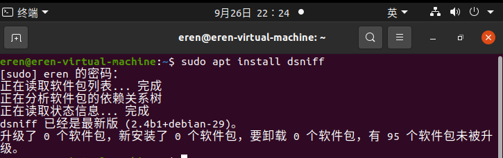

# 一. ARP协议概述

建议你先学习计算机网络以及ARP协议部分。

## 1. arp缓存

### 查看你的主机arp缓存

arp缓存表存储在主机的内存中。

- 对于Windows操作系统，你可以在终端中使用命令arp -a查看电脑的arp缓存表。
- 对于Linux操作系统，使用命令arp即可。

### 你的arp缓存表的内容

一般来说，arp缓存只关心子网下其他主机。

- 对于路由器下的子网，arp缓存其他主机的MAC地址为路由器（网关）的MAC地址，因为主机访问其他主机的下一跳是路由器。
- 对于交换机下的子网，arp缓存其他主机的真实MAC地址。
- 当你访问子网外的IP地址时，MAC地址默认为网关地址。

## 2. arp报文

你可以使用python的scapy库写一个arp请求函数，这非常简单。

```python
def arp(ipy):
    dst_ip_list = IPY(ipy)
    alive_ip_list = []

    for dst_ip in dst_ip_list:
        pkt = ARP(pdst=str(dst_ip))
        # pkt.show()
        ans = sr1(pkt, timeout=1, verbose=False)
        if ans is not None:
            # ans.summary()
            # ans.show()
            alive_ip_list.append(dst_ip)
            print(dst_ip, 'is up')
        else:
            print(dst_ip, 'is closed')

    return alive_ip_list

```

构造一个请求，通过warsahrk抓包，你可以对协议的实现有更多了解。

# 二. 断断室友的网？刑

_本次实验在虚拟环境中完成，你需要知道未被授权的攻击不被允许。_
当你了解arp缓存和arp报文相关内容以后，下面这一步非常简单。
这里有两台虚拟机。Ubuntu（20.04）发起arp攻击；Windows（7）作为被攻击对象，并查看被攻击后的结果。
下面是实操部分：

## 1. Ubuntu发起攻击

### 安装dsniff

在终端输入命令 _sudo apt install dsniff_，这里我已经安装完成。



### 使用dsniff毒化目标主机

_网关IP：192.168.59.2_
_目标主机IP：192.168.59.137_


## 2. Windows受到攻击

### 受到攻击之前

Windows虚拟机可以正常访问网络，这里访问百度作为测试


### 受到攻击之后

Windows虚拟机无法正常访问网络


### 看看Windows虚拟机arp缓存表

可以看到Windows主机arp缓存被毒化之后网关IP映射的MAC地址变成了发起攻击Ubuntu的MAC地址。因此Windows虚拟机访问其他主机时，流量指向发起攻击的Ubuntu主机。利用这一点我们还可以做一些事情，比如中间人攻击。

